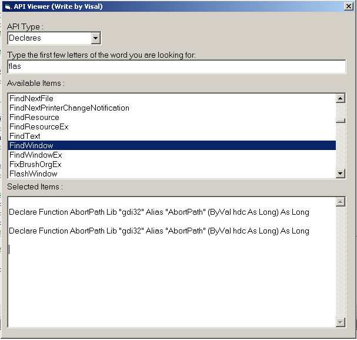



## API Viewer

### Description

API Viewer , list all Declare Functions Consts and types and show you how to search text in list very fast. this is my first project that i upload to PSC please vote if you think is good.
 
### More Info
 

             |
---                |---
**Submitted On**   |2004-05-31 14:14:16
**By**             |[In Visal](https://github.com/Planet-Source-Code/PSCIndex/blob/master/ByAuthor/in-visal.md)
**Level**          |Beginner
**User Rating**    |2.8 (11 globes from 4 users)
**Compatibility**  |VB 5\.0, VB 6\.0
**Category**       |[Coding Standards](https://github.com/Planet-Source-Code/PSCIndex/blob/master/ByCategory/coding-standards__1-43.md)
**World**          |[Visual Basic](https://github.com/Planet-Source-Code/PSCIndex/blob/master/ByWorld/visual-basic.md)
**Archive File**   |[API\_Viewer175250612004\.zip](https://github.com/Planet-Source-Code/in-visal-api-viewer__1-54131/archive/master.zip)

